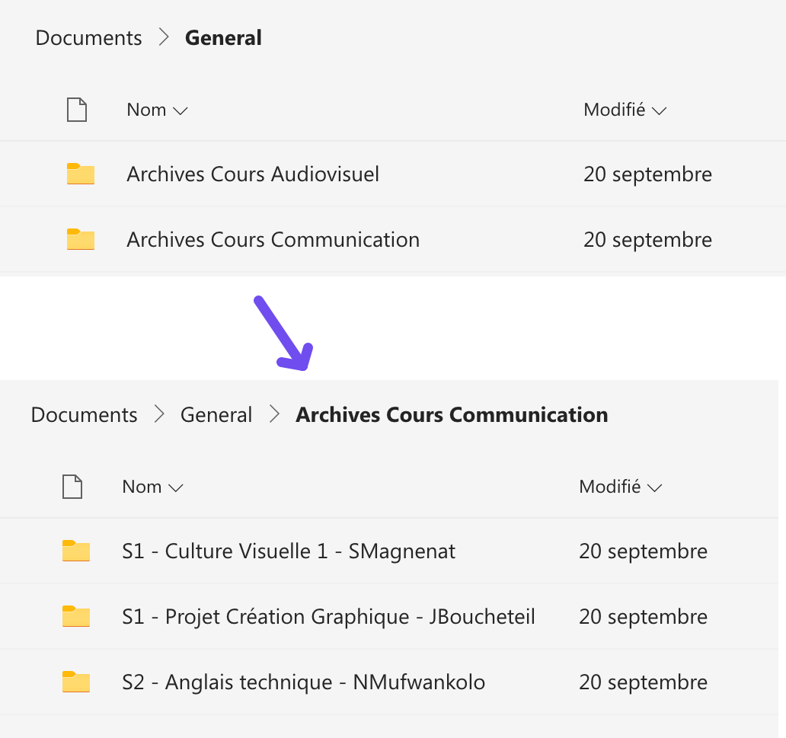

## Archiver les anciens cours

Depuis l'année 2021-22, les groupes Teams des classes sont conservés d'une année à l'autre. Il est donc nécessaire, lorsqu'un cours se termine, de faire une procédure d'archivage.

À la fin du semestre, voici la procédure recommandée pour archiver les données de votre cours:

1. Déplacer les fichiers depuis le canal dédié du cours vers le canal *Général*, dans un dossier *Archives*. Conseil: utiliser l'action "Déplacer vers".
2. Une fois les fichiers déplacés, il est important de supprimer le canal du cours. Il faut éviter de se retrouver avec une longue liste de canaux inactifs.

Exemple de structure de dossier pour les cours archivés:

