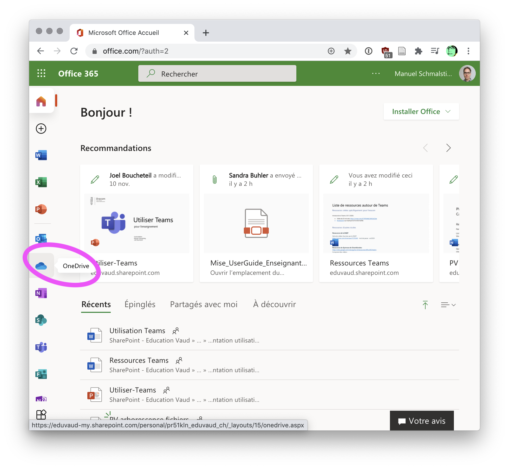
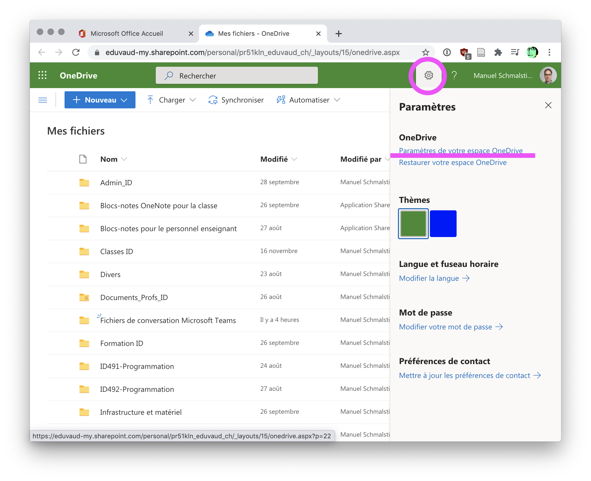
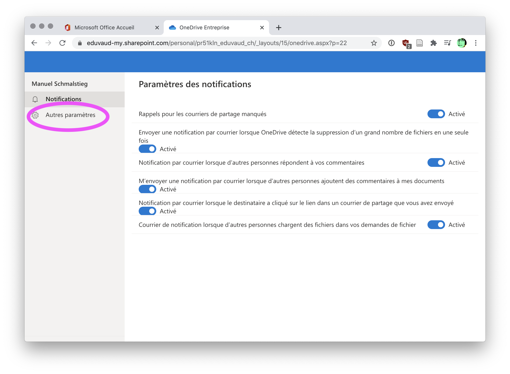
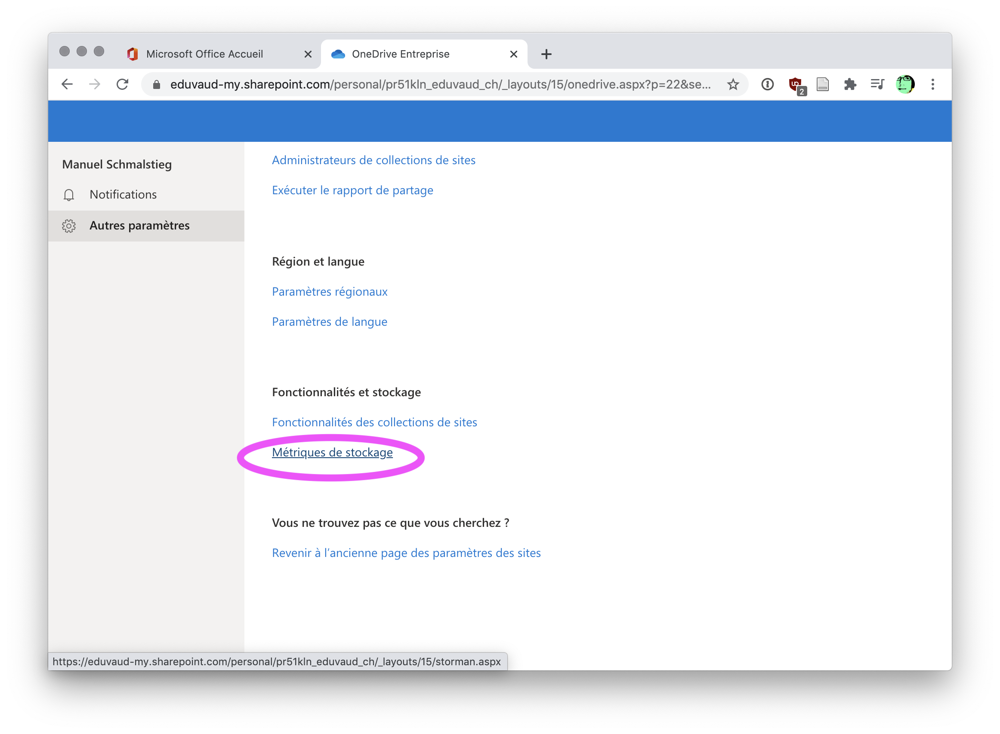
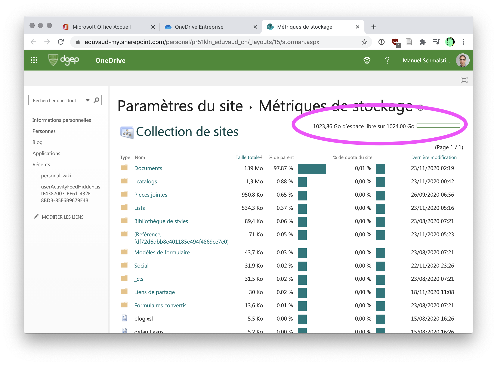

### Comment connaître l'espace disponible dans OneDrive?

Votre compte OneDrive comporte 1To d'espace disque. Comment savoir quelle partie de cet espace est utilisé? 

Voici la procédure: 

1. Se connecter à [office.com](https://office.com) à l’aide de votre compte professionnel ou scolaire.
2. Sélectionner l'outil OneDrive.
3. Se rendre sous: **Paramètres > Paramètres de votre espace OneDrive**:
4. Se rendre sous: **Autres paramètres > Métriques de stockage**.

Vous verrez ainsi votre utilisation précise.

