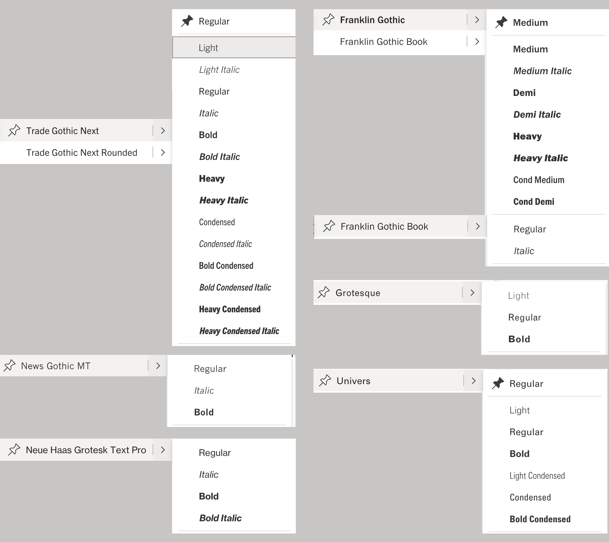

Les choix typographiques disponibles pour l'édition de documents dans Teams sont très éclectiques. Il s'agit d'une sélection de fontes opérée par Microsoft.

De nouvelles fontes sont ajoutées périodiquement, comme l'ajout de **Aptos**, qui semble être la nouvelle fonte par défaut à partir de 2023.

Ressources:

- Un [document-spécimen dans Teams ](https://eduvaud.sharepoint.com/:w:/s/ERACOM_ID_Teams/EXzWRsuxxhNNl7tRMJSScVMBwrNik2GT2KvVhCqsfaFLKg?e=eIz3Be)
- Un [spécimen PDF](img/typo/MS-word-gothics.pdf)

Liste de fontes sans-serif utilisables pour les documents:

